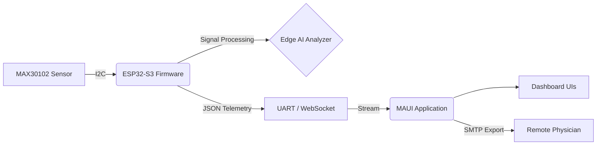
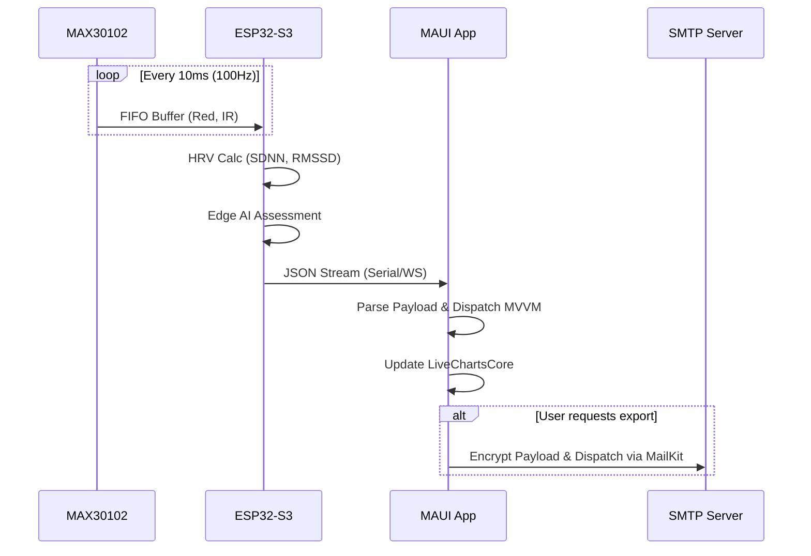

# PulseMonitor Platform Architecture

This document describes the architectural design, component interactions, and data flows of the **PulseMonitor** project, an end-to-end medical IoT prototype for tracking real-time heart rate, SpO2 (oxygen saturation), and HRV (Heart Rate Variability), augmented with continuous Edge AI Diagnostics.

---

## 1. High-Level System Overview

The system consists of a two-tier architecture:

1. **Hardware & Edge Tier (Firmware)**: An ESP32-S3 microcontroller interfaced with a MAX30102 optical sensor. It handles high-frequency data acquisition, signal processing, and continuous on-device AI analytics.
2. **Client Presentation Tier (App)**: A cross-platform UI built with .NET 8 MAUI that consumes telemetry streams, visualizing waveform data, presenting AI diagnostic insights, and enabling SMTP-based medical reporting.

---

## 2. Hardware & Edge Tier

The device's edge capability handles all critical mathematical computations, minimizing latency and the data payload transported to the client application.

### 2.1 Hardware Components
- **Microcontroller**: ESP32-S3 (Dual-core Xtensa LX7 @ 240MHz, 512KB SRAM, 8MB Flash). Suitable for complex DSP and Edge AI constraints.
- **Sensor**: MAX30102. Communicates via the I2C protocol (`0x57`), relying on Red and IR LEDs for photoplethysmogram (PPG) acquisition.
  - **SCL/SDA Pin Mapping**: GPIO 9 & 8.
  - **Interrupt Pin (IRQ)**: GPIO 4.

### 2.2 Firmware Architecture (PlatformIO)
Developed in C/C++ using the Arduino Core on PlatformIO.

* **Acquisition Domain**: Runs a 100Hz fixed sampling loop to read RED and IR values from the MAX30102 FIFO buffer.
* **Analysis Domain (`hrv_analyzer.cpp`)**: Calculate Heart Rate Variability (HRV) metrics in near real-time without blocking the sampling loop.
  - Identifies R-peaks to calculate R-R intervals (RRIs).
  - Calculates time-domain variables like **SDNN** (Standard Deviation of NN intervals) and **RMSSD** (Root Mean Square of Successive Differences).
* **On-Device Edge AI Diagnostics**:
  - Infers **Stress Levels** and **Rhythm Types** locally on the ESP32-S3 based on the continuous HRV vector space.
* **Telemetry Domain**: Formats combined metrics into structured JSON payloads (`ArduinoJson v7`) and dispatches them across standard output (Serial / 115200 baud) or dynamically routes them through a WebSocket Server (`WebSockets` extension) if Wi-Fi mode is compiled (`-DUSE_WIFI`).

---

## 3. Client Application Tier (.NET 8 MAUI)

The UI client is a cross-platform (Windows & Android) application designed to connect to the telemetry stream and project the data onto interactive dashboards.

### 3.1 Architectural Pattern
The application relies on the **Model-View-ViewModel (MVVM)** pattern, leveraging `CommunityToolkit.Mvvm` to synchronize dynamic UI elements smoothly with the continuous background telemetry thread.

### 3.2 Core Subsystems

**1. Hardware Abstraction Layer (`Hardware/`):**
Manages the inbound telemetry transport layer. Dependent on `appsettings.json` runtime configuration, the service mounts via `System.IO.Ports.SerialPort` (for USB debugging) or `Websocket.Client` (for detached wireless execution).

**2. Data Processing Pipeline (`Processing/`):**
Deserializes JSON payloads mapping hardware data structures into C# objects (e.g. `AiDiagnosticResult.cs` and `HrvProcessor.cs`). Runs client-side validation logic mapping SpO2 via approximate R-ratio calibrations and isolates LF/HF bands (Low/High frequency) for charting spectrum ranges.

**3. User Interface & Bindings (`Views/` & `ViewModels/`):**
UI views built with purely accessible standard XAML.
- **Primary Dashboard UI**: Relies on `LiveChartsCore.SkiaSharpView.Maui` for high framerate plotting of raw PPG waveforms, BP gradients, and instant BPM readings. 
- **AI Diagnostics View**: Discovered through swipe gestures, revealing hardware AI classification statistics combined with rich client-rendered Frequency Spectrum models. 

**4. External Reporting (`Export/`):**
Provides medical charting snapshots for diagnostic tracking. Built over `MailKit/MimeKit`, the app triggers manual or threshold-based event closures to bundle diagnostic history into formal reports dispatched over SMTP.

---

## 4. Component Interaction Sequence

## 5. Security and Limitations
- The system employs SMTP SSL configurations via App Passwords.
- All edge-computed values eliminate the need to pump raw biological sensor data into generic cloud platforms prioritizing Privacy by Design (PbD).
- **Not FDA Cleared**: R-Ratio SpO2 calibration (`+/-2%`) is strictly experimental. All AI inference is isolated for learning and IoT diagnostics prototypes only.
