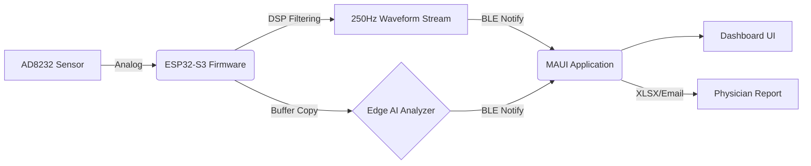
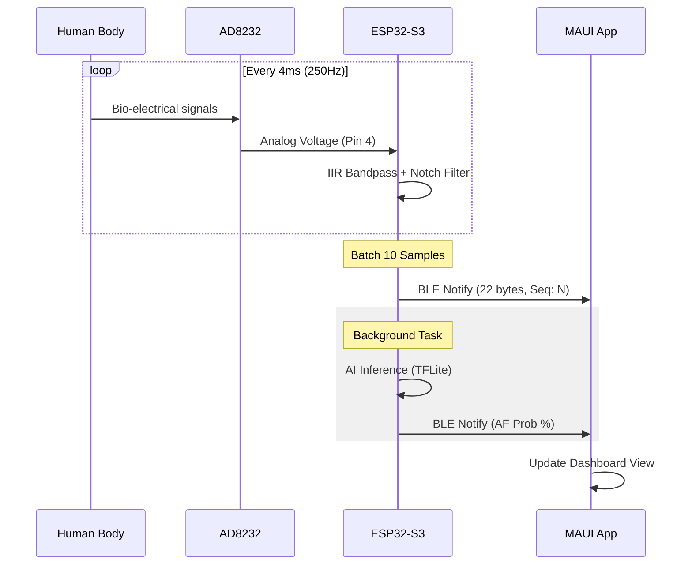

# PulseMonitor Platform Architecture (v2.0)

This document describes the architectural design, component interactions, and data flows of the **PulseMonitor** project, an end-to-end medical IoT prototype for tracking real-time **ECG (Electrocardiogram)**, augmented with continuous **Edge AI Diagnostics**.

---

## 1. High-Level System Overview

The system consists of a two-tier architecture optimized for low-latency biological signal processing:

1. **Hardware & Edge Tier (Firmware)**: An ESP32-S3 microcontroller interfaced with an **AD8232** ECG sensor. It handles 250Hz data acquisition, 4th-order DSP filtering, and continuous on-device AI analytics using TensorFlow Lite Micro.
2. **Client Presentation Tier (App)**: A cross-platform UI built with **.NET 8 MAUI** that consumes BLE telemetry streams, visualizing waveform data, presenting AI diagnostic insights, and enabling medical data export.

---

## 2. Hardware & Edge Tier (Firmware)

The device's edge capability handles all critical mathematical computations, minimizing latency and the data payload transported to the client application.

### 2.1 Hardware Components
- **Microcontroller**: ESP32-S3 (Dual-core Xtensa LX7 @ 240MHz, 320KB Internal SRAM, 8MB Flash).
- **Sensor**: **AD8232** Single-Lead Heart Rate Monitor.
  - **ECG Output**: GPIO 4 (ADC1_CH3).
  - **Lead-Off +**: GPIO 5 (with internal pull-down).
  - **Lead-Off -**: GPIO 6 (with internal pull-down).
  - **Shutdown (SDN)**: GPIO 7.

### 2.2 Signal Processing Pipeline
Developed in C/C++ using the Arduino Core on PlatformIO.

* **Sampling Layer**: Runs a **250Hz** hardware timer interrupt for precise ADC acquisition.
* **DSP Domain (`ecg_dsp.h`)**:
  - **Bandpass Filter**: 4th-order IIR (0.5Hz to 30Hz) to remove baseline wander and muscle noise.
  - **Notch Filter**: 50Hz (Q=30) to eliminate power line interference.
* **Communication Layer**: Uses **NimBLE-Arduino** for high-efficiency BLE.
  - **Batching**: Groups 10 samples into a single 22-byte BLE packet ([2 bytes Seq] + [20 bytes Data]) to reduce packet overhead.
* **Edge AI Domain (`af_inference.cpp`)**:
  - Runs **TensorFlow Lite Micro** in a background task.
  - Analyzes 10-second windows (2500 samples) to detect Atrial Fibrillation (AF).

---

## 3. Client Application Tier (.NET 8 MAUI)

The UI client is a cross-platform (Android) application designed to connect to the BLE stream and project data onto interactive dashboards.

### 3.1 Core Subsystems

**1. BLE Hardware Abstraction (`Hardware/EcgBleReader.cs`):**
- Manages the Bluetooth LE lifecycle (Scanning, Connecting, MTU Negotiation).
- **MTU Optimization**: Explicitly requests **247 bytes** MTU to handle high-frequency streams without truncation.
- **Parsing**: Reconstructs the 250Hz waveform by stripping sequence numbers and handling packet loss via `NaN` interpolation.

**2. Visualization Pipeline (`Views/DashboardContentView.xaml`):**
- Relies on **SkiaSharp** via `LiveChartsCore` for high-performance plotting.
- Visualizes 1250 points (5 seconds) of filtered ECG data in a rolling buffer.

**3. AI Diagnostic Interface:**
- Consumes asynchronous `AfProbabilityReceived` events.
- Displays real-time risk assessments and diagnostic metrics.

---

## 4. Interaction Sequence

---

## 5. Deployment Configurations

| Environment | Purpose | BLE | AI | Output |
| :--- | :--- | :--- | :--- | :--- |
| `esp32s3_ecg` | Production / Clinical Test | ON | ON | BLE + Mobile App |
| `stream_test` | AI Model Validation | OFF | ON | Serial (PC) |

---
*Last Updated: 2026-04-30 by Antigravity AI*
