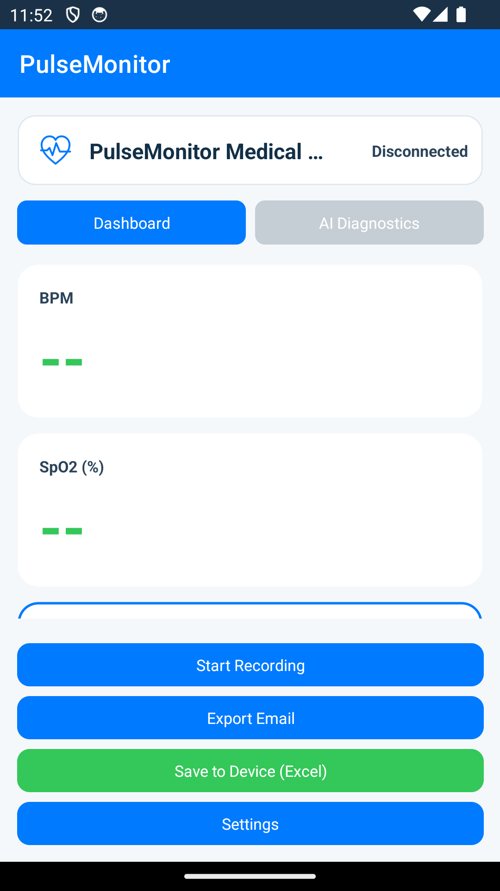
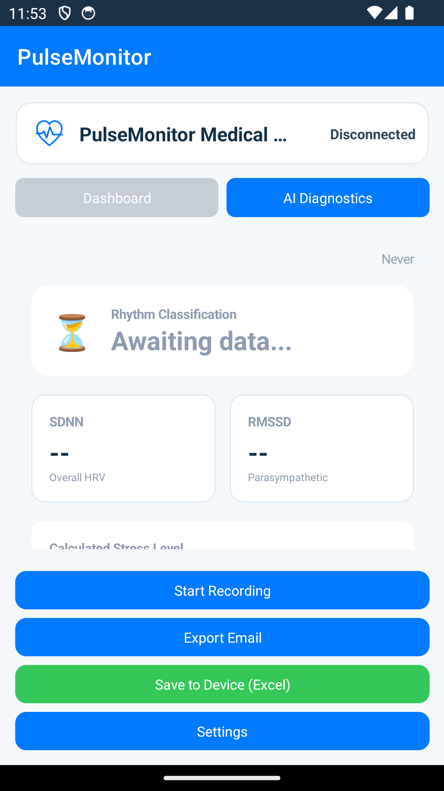
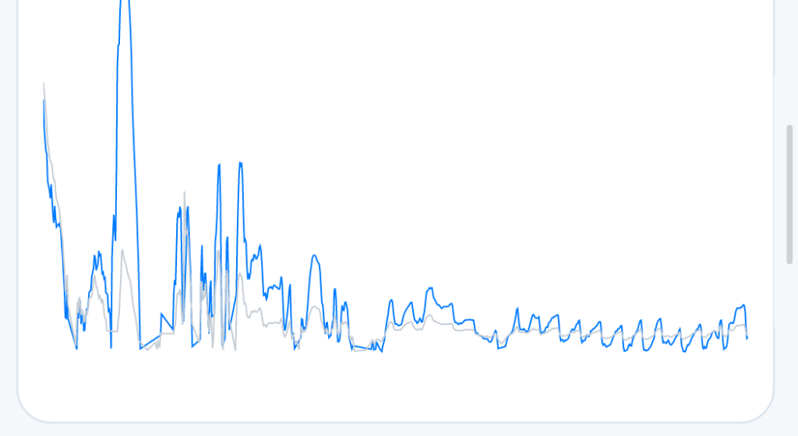
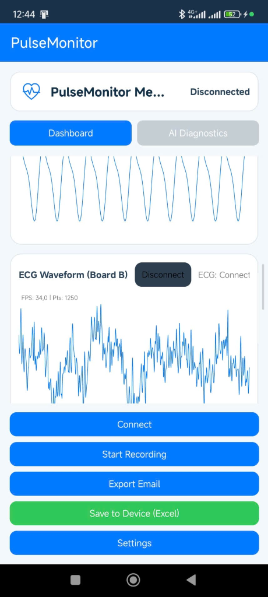
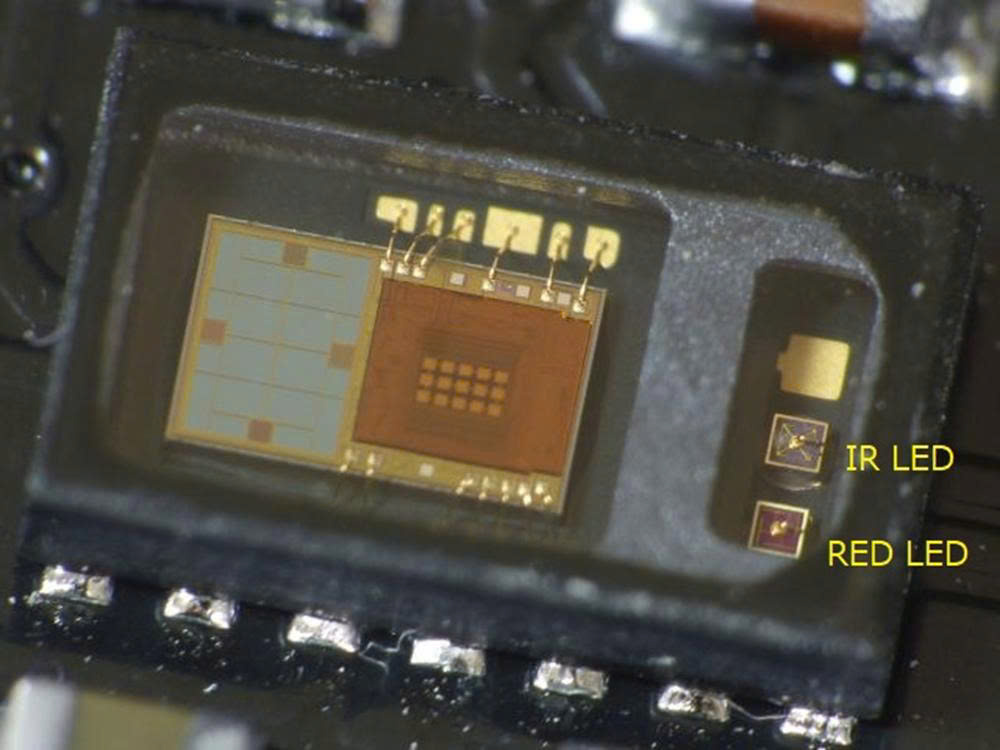
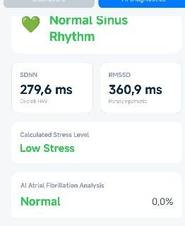

# MedTech Device — Advanced ECG & AI Diagnostics Ecosystem

<div align="center">
   &nbsp;&nbsp;
   &nbsp;&nbsp;
   &nbsp;&nbsp;
   &nbsp;&nbsp;
  
</div>

**MedTech Device** là một giải pháp y tế IoT toàn diện, kết hợp khả năng thu thập tín hiệu sinh học tần số cao với trí tuệ nhân tạo biên (Edge AI). Hệ thống cho phép theo dõi điện tâm đồ (ECG) và nồng độ oxy trong máu (SpO2), đồng thời phân tích biến thiên nhịp tim (HRV) và chẩn đoán rung tâm nhĩ (AF) ngay trên thiết bị cầm tay.

---

## 📸 Demo & Interface

| **Real-time Dashboard** | **AI Diagnostics** | **Frequency Domain Analysis** |
|:---:|:---:|:---:|
|  |  |  |

---

## 🚀 Tính năng cốt lõi

- **Duyệt sóng tim thời gian thực**: Stream dữ liệu ECG 250Hz và PPG 100Hz mượt mà qua BLE.
- **Edge AI Diagnostics**: Chạy mô hình phân loại nhịp tim TFLite Micro trực tiếp trên ESP32-S3 (không cần Internet).
- **Phân tích HRV chuyên sâu**: Tính toán SDNN, RMSSD và tỷ lệ LF/HF để đánh giá Stress và hệ thần kinh thực vật.
- **Báo cáo y tế**: Tự động xuất file Excel và gửi báo cáo qua Email cho bác sĩ chỉ với 1 chạm.
- **Cảnh báo thông minh**: Tự động phát hiện lỗi tiếp xúc điện cực (Lead-off detection).

---

## 🛠 Tech Stack

- **Hardware**: ESP32-S3 (Dual-core 240MHz, 8MB PSRAM), MAX30102 (PPG), AD8232 (ECG).
- **Firmware**: C++ (Arduino Core), PlatformIO, ArduinoJson, NimBLE.
- **Edge AI**: TensorFlow Lite for Microcontrollers.
- **Mobile App**: .NET MAUI 8.0 (C#), LiveChartsCore, SkiaSharp, MailKit.
- **Protocol**: Bluetooth Low Energy (GATT).

---

## 📦 Linh kiện phần cứng

Hệ thống sử dụng các linh kiện y tế và vi điều khiển hiệu năng cao để đảm bảo tính ổn định:

| **Bộ vi xử lý (ESP32-S3)** | **Cảm biến PPG (MAX30102)** | **Module ECG (AD8232)** |
|:---:|:---:|:---:|
|  |  |  |
| *Dual-core 240MHz, tích hợp AI Accelerators* | *Đo SpO2 & Nhịp tim qua quang học* | *Thu thập điện tâm đồ (ECG) chuẩn y tế* |

---

## 📂 Kiến trúc hệ thống (Architecture)

### Cấu trúc thư mục chi tiết
```text
├── firmware/              # Mã nguồn ESP32-S3 (PlatformIO)
│   ├── src/
│   │   ├── ble_manager.cpp    # Quản lý giao thức GATT & Advertising
│   │   ├── hrv_analyzer.cpp   # Thuật toán phân tích biến thiên nhịp tim
│   │   ├── peak_detector.cpp  # Bộ lọc & phát hiện đỉnh R-Peak
│   │   ├── spo2_calculator.cpp # Thuật toán tính SpO2 (Red/IR Ratio)
│   │   └── main.cpp           # Luồng thực thi chính (100Hz Loop)
│   └── platformio.ini         # Cấu hình thư viện (NimBLE, ArduinoJson)
├── PulseMonitor/          # Ứng dụng di động (.NET MAUI)
│   ├── ViewModels/            # Xử lý logic MVVM & Data Binding
│   ├── Hardware/              # Giao tiếp BLE tầng thấp
│   ├── Views/                 # UI/UX (XAML)
│   └── Resources/             # Assets, Fonts, Logos
├── docs/                  # Tài liệu & Hình ảnh
│   ├── images/                # Screenshots & Demo
│   └── logos/                 # Official Tech Logos
└── Test/                  # Scripts kiểm thử (Python)
```

### Luồng dữ liệu (Data Flow)
1. **Sensor Layer**: Thu thập dữ liệu thô từ cảm biến quang học (PPG) và điện cực (ECG).
2. **DSP Layer**: ESP32-S3 thực hiện lọc nhiễu 50Hz và chuẩn hóa tín hiệu.
3. **Analytics Layer**: Tính toán RR-Intervals và các chỉ số HRV (SDNN, RMSSD).
4. **Transport Layer**: Đóng gói dữ liệu JSON và truyền qua BLE Notify.
5. **UI Layer**: Ứng dụng di động giải mã dữ liệu và vẽ biểu đồ thời gian thực.

---

## 🛠 Thông số kỹ thuật chuyên sâu (Technical Deep Dive)

### 1. Giao thức Bluetooth LE (GATT)
Hệ thống sử dụng các UUID tùy chỉnh để truyền tải dữ liệu hiệu quả:
- **Service UUID**: `DE010001-0000-1000-8000-00805F9B34FB`
- **Waveform Characteristic (Notify)**: `DE010003-...` (Truyền sóng thô IR/Red)
- **Metrics Characteristic (Notify)**: `DE010004-...` (Truyền BPM, SpO2, HRV)

### 2. Thuật toán phân loại nhịp tim
Phân loại dựa trên biến thiên của các khoảng NN (NN-intervals):
- **Normal**: Nhịp tim đều đặn trong dải 50-120 BPM.
- **Tachycardia**: Nhịp nhanh (RR < 500ms).
- **Bradycardia**: Nhịp chậm (RR > 1200ms).
- **Irregular**: Nhịp không đều (Hệ số biến thiên CoV > 0.18) - Dấu hiệu cảnh báo AF.

### 3. Đánh giá mức độ Stress (SDNN-based)
- **Thấp (Low)**: SDNN ≥ 50ms
- **Trung bình (Moderate)**: 30ms ≤ SDNN < 50ms
- **Cao (High)**: 20ms ≤ SDNN < 30ms
- **Rất cao (Very High)**: SDNN < 20ms

---

## 🚦 Hướng dẫn bắt đầu (Getting Started)

### 1. Chuẩn bị phần cứng
- **ESP32-S3**: Vi xử lý trung tâm.
- **MAX30102**: Kết nối I2C (SDA: GPIO 8, SCL: GPIO 9).
- **AD8232**: Kết nối Analog (Output: GPIO 1).

### 2. Cấu hình Firmware (PlatformIO)
1. Mở thư mục `firmware` bằng VS Code.
2. Kiểm tra `platformio.ini` và nạp code (Upload).
3. Mở Serial Monitor (115200) để xem log hệ thống.

### 3. Cài đặt Ứng dụng di động
1. Cài đặt .NET 8 SDK và workload MAUI.
2. Build project `PulseMonitor` lên thiết bị Android/iOS.
3. Chấp nhận quyền vị trí (Location) và Bluetooth để kết nối với thiết bị.

---

## ⚙️ Biến môi trường & Cấu hình
| Biến | Mô tả | Giá trị mặc định |
|:---|:---|:---|
| `BLE_NAME` | Tên thiết bị hiển thị | `PulseMonitor` |
| `SMTP_SERVER` | Server gửi Email báo cáo | `smtp.gmail.com` |
| `SMTP_PORT` | Cổng SMTP | `587` |

---

## 🧪 Kiểm thử (Testing)
- **Unit Test**: Kiểm tra các thuật toán DSP trong thư mục `Test/`.
- **Integration Test**: Sử dụng `nRF Connect` để kiểm tra các Characteristic của BLE.
- **Simulation**: Sử dụng các tập tin `.csv` từ MIT-BIH database để giả lập tín hiệu tim.

---

## 🛠 Khắc phục sự cố (Troubleshooting)
- **Không tìm thấy thiết bị BLE**: Đảm bảo ESP32 đã được cấp nguồn và đang nháy LED xanh.
- **Tín hiệu nhiễu mạnh**: Kiểm tra dây tiếp địa (GND) và tránh xa các nguồn nhiễu điện từ (Adapter sạc, Motor).
- **Lỗi Email Export**: Kiểm tra lại mật khẩu ứng dụng (App Password) trong cấu hình Gmail.

---

## 📜 Giấy phép & Đóng góp
- **License**: MIT License.
- **Contribution**: Mọi đóng góp về thuật toán AI và cải thiện UI đều được chào đón qua Pull Request.

---
*Dự án được thực hiện bởi Thinhqn0905 & Antigravity AI — 2024*
